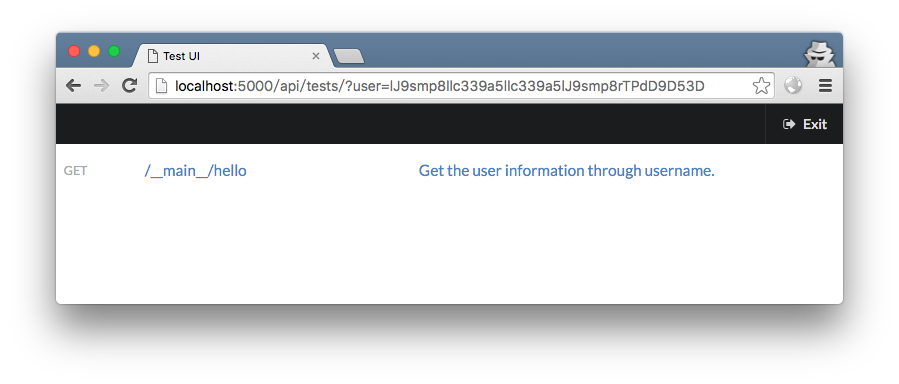

.. _quick_start:

QuickStart
==========

Eager to get started?  This page gives a good introduction to Flask http api.  It
assumes you already have flask-http-api installed.  If you do not, head over to the
:ref:`installation` section.

A Minimal Application
---------------------

A minimal Http API application looks something like this

hello.py::

    from flask import Flask
    from http_api import CView
    from http_api.configure import http_api_setup
    from http_api.utility import load_yaml

    class Hello(CView):

        def get(self, username):
            """Get the user information through User account name.

            This is a demonstration using Flask Http Api.

            :param Str * username: User account name
            :raise not_exist: Record does not exist.
            """
            if username == 'remy':
                return self.r('not_exist')

            return self.r('success', {'id': 1, 'username': username, '...': '...'})

    app = Flask(__name__)
    http_api_setup(app, load_yaml('hello.yml'))

    if __name__ == '__main__':
        app.run()

hello.yml::

    app:
      workspace: .

      parameter_types:
        - http_api.parameter

      responses:
        json: http_api.response.JsonRaise
        default: json

      web_ui:
        access_keys:
          - lJ9smp8llc339a5llc339a5lJ9smp8rTPdD9D53D
        uri: api
        test_ui:
          uri: tests
        doc_ui:
          uri: docs

Run it with your Python interpreter.::

    $ python hello.py
     * Running on http://127.0.0.1:5000/

Document
--------

Now head over to http://127.0.0.1:5000/api/docs/#hello, and you should see hello's api document.

Test
----

Now head over to http://127.0.0.1:5000/api/tests/, and you should see test ui.

Input access key that defined in hello.yml, click "Enter", and you should see a api list.

Click link, and you should see your hello's test ui.

Click :ref:`dessert-test_ui` to view more information.

Logging Query
-------------

